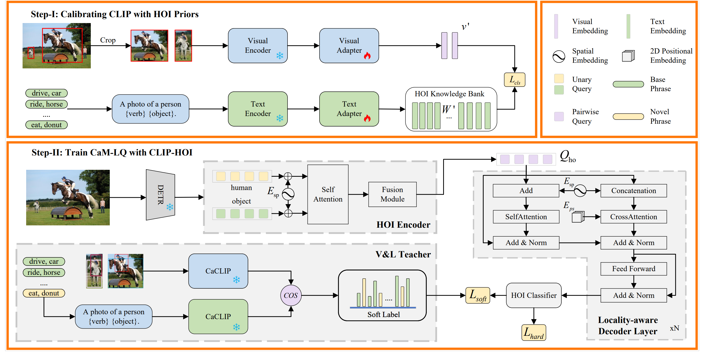
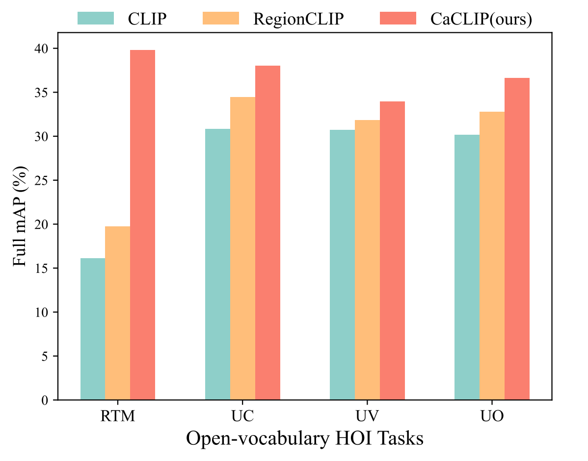

# Towards Open-vocabulary HOI Detection with Calibrated Vision-language Models and Locality-aware Queries

Official code for [Towards Open-vocabulary HOI Detection with Calibrated Vision-language Models and Locality-aware Queries](https://anonymous.4open.science/r/cam_lq)

## Abstract
> The open-vocabulary human-object interaction (Ov-HOI) detection aims to identify both base and novel categories of human-object interactions while only base categories are available during training. Existing Ov-HOI methods commonly leverage knowledge distilled from CLIP to extend their ability to detect previously unseen interaction categories. However, our empirical observations indicate that the inherent noise present in CLIP  has a detrimental effect on HOI prediction. Moreover, the absence of novel human-object position distributions often leads to overfitting on the base categories within their learned queries.To address these issues, we propose a two-step framework named, CaM-LQ Calibrating visual-language Models, (e.g., CLIP) for open-vocabulary HOI detection with Locality-aware Queries. By injecting the fine-grained HOI supervision from the calibrated CLIP into the HOI decoder, our model can achieve the goal of predicting novel interactions. Extensive experimental results demonstrate that our approach performs well in open-vocabulary human-object interaction detection, surpassing state-of-the-art methods across multiple metrics on mainstream datasets and showing superior open-vocabulary HOI detection performance.

<div align="center">
  
</div>


## Comparison
Current methods (HOICLIP, CLIP4HOI, EoID, GEN_VLKT, ADA-CM) mainly use V&L model (e.g. CLIP) to handle Ov-HOI tasks. However, they mainly suffer from intrinsic noise (refer to the table below) in the V&L models owing to the gap of pre-training on the other domain datasets, resulting in severe decline of performance decrease. The calibrating process makes it to adapt to our region level HOI detection tasks. 

<div align="center">
    
</div>


## Use of the Code
### Environment
#### Prerequisites
To begin, create a virtual environment for the project. Name this environment `cam_lq` and ensure that the `Python` version installed within it is 3.8 (more stable). 
```
conda create -n cam_lq python=3.8
```
Then, we need to supplement the library PyTorch=1.8.0, which requires CUDA=11.1.
```
pip install torch==1.8.0+cu111 torchvision==0.9.0+cu111 -f https://download.pytorch.org/whl/torch_stable.html
```
Please try installing the additional libraries by running the command below.
```
pip install matplotlib==3.6.3 scipy==1.10.0 tqdm==4.64.1
pip install numpy==1.24.1 timm==0.6.12
pip install wandb==0.13.9 seaborn==0.13.0
```

Then please clone our repo and submodules.

Note that we use the pocket library and you can install it by the following command.

```
cd cam_lq
git submodule init
git submodule updatecd 
pip install -e pocket
```

Our code is built upon [CLIP](https://github.com/openai/CLIP). Install the local package of CLIP:

```
cd CLIP && python setup.py develop && cd ..
```

Finally, for the use of advanced detector, you should build CUDA operator for MultiScaleDeformableAttention.

```
cd h_detr/model/ops
python setup.py build install
```


### About Dataset

For our experiments, we utilized three popular datasets: [HICO-DET](https://drive.google.com/open?id=1QZcJmGVlF9f4h-XLWe9Gkmnmj2z1gSnk), V-COCO (contained in [MS COCO](https://cocodataset.org/#download)), and VG150

1. Prepare the [HICO-DET](https://drive.google.com/open?id=1QZcJmGVlF9f4h-XLWe9Gkmnmj2z1gSnk)

   1. If you have not downloaded the dataset before, run the following script.

      ```
      cd /path/to/cam_lq/hicodet
      bash download.sh
      ```

   2. If you have previously downloaded the dataset, simply create a soft link.

      ```
      cd /path/to/cam_lq/hicodet
      ln -s /cam_lq/to/hicodet_20160224_det ./hico_20160224_det
      ```

2. Prepare the V-COCO dataset (contained in [MS COCO](https://cocodataset.org/#download))

   1. If you have not downloaded the dataset before, run the following script

      ```
      cd /path/to/cam_lq/vcoco
      bash download.sh
      ```

   2. If you have previously downloaded the dataset, simply create a soft link

      ```
      cd /path/to/cam_lq/vcoco
      ln -s /path/to/coco ./mscoco2014
      ```

3. Prepare the VG150 dataset

   Please follow the [instuction](https://github.com/danfeiX/scene-graph-TF-release/blob/master/data_tools/README.md) to prepare the VG150 and annotation files: `VG-SGG-with-attri.h5`, `VG-SGG-dicts-with-attri.json`, `image_data.json`

   Then run the following command to obtain HOI-format annotation:

   ```
   python preprocess_vg.py --output [PATH_TO_SAVE_ANNOTATION]
   ```

## Pre-training

The pre-training is to calibrate CLIP to eliminate the intrinsic noise.

1. After preparing the dataset, running the following command to obtain our pre-training datasets format. Ov_HOI_SETTING includes `default`, `UA`, `rare_first`, `non_rare_first`, `uc0`, `uc1`, `uc2`, `uc3`, `uc4`, `UO`.

   ```
   python crop_[DATASET]2img.py --setting [Ov_HOI_SETTING] --save_img_dir [PATH_TO_SAVE_CROP_IMAGE] --save_anno_dir [PATH_TO_SAVE_ANNOTATION] --image_dir [PATH_TO_IMAGE_DIR]
   ```

2. Combine the images and merge annotation files for the three datasets and start calibrating CLIP.

   ```
   python pretrain_clip.py --anno_dir [PATH_TO_SAVE_ANNOTATION] --img_dir [PATH_TO_SAVE_CROP_IMAGE] --output [PATH_TO_SAVE_CaCLIP]
   ```

### Training and Testing

1. In order to get the pre-trained backbone，you can download and put them in `checkpoints/`

| Dataset  | Backbone          | DETR weights                                                 |
| -------- | ----------------- | ------------------------------------------------------------ |
| HICO-DET | DETR-R50          | [weights](https://drive.google.com/file/d/1BQ-0tbSH7UC6QMIMMgdbNpRw2NcO8yAD/view?usp=sharing) |
|          | H-Defm-DETR-SwinL | [weights](https://drive.google.com/file/d/1wge-CC1Fx67EHOSXyHGHvrqvMva2jEkr/view?usp=share_link) |
| V-COCO   | DETR-R50          | [weights](https://drive.google.com/file/d/1AIqc2LBkucBAAb_ebK9RjyNS5WmnA4HV/view?usp=sharing) |
|          | H-Defm-DETR-SwinL | [weights](https://drive.google.com/file/d/1GJs0BAJgJgFODE6oLxVE_N87nymXJLMy/view?usp=sharing) |

2. Then start to train your model:

### HICO-DET

1. For DETR-R50

```
DETR=base python main.py \
    --pretrained checkpoints/detr-r50-hicodet.pth \
    --pretrain_clip [PATH_TO_SAVE_CaCLIP] \
    --setting [Ov-HOI_SETTING] \
    --output [PATH_TO_SAVE_ChECKPOINT]
```

2. For H-Defm-DETR-SwinL

```
DETR=advanced python main.py \
    --pretrained checkpoints/h-defm-detr-swinL-dp0-mqs-lft-iter-2stg-hicodet.pth \
    --batch-size 60 \
    --drop-path-rate 0.5 \
    --world-size 2 \
    --backbone swin_large \
    --use-checkpoint \
    --num-queries-one2one 900 \
    --num-queries-one2many 1500 \
    --setting [Ov-HOI_SETTING] \
    --pretrain_clip [PATH_TO_SAVE_CaCLIP] \
    --output-dir [PATH_TO_SAVE_ChECKPOINT]
```

### V-COCO

1. For DETR-R50

```
DETR=base python main.py \
    --dataset vcoco --data-root vcoco/ \
    --partitions trainval test \
    --pretrained checkpoints/detr-r50-vcoco.pth \
    --setting [Ov-HOI_SETTING] \
    --pretrain_clip [PATH_TO_SAVE_CaCLIP] \
    --output-dir [PATH_TO_SAVE_ChECKPOINT]
```

2. For H-Defm-DETR-SwinL

```
DETR=advanced python main.py \
    --dataset vcoco --data-root vcoco/ --partitions trainval test \
    --num-queries-one2many 1500 \
    --pretrained checkpoints/h-defm-detr-r50-dp0-mqs-lft-iter-2stg-vcoco.pth \
    --batch-size 120 \
    --setting [Ov-HOI_SETTING] \
    --pretrain_clip [PATH_TO_SAVE_CaCLIP] \
    --output-dir [PATH_TO_SAVE_ChECKPOINT]
```

## Inference

Visualisation utilities are implemented to run inference on a single image and visualise the cross-attention weights. After training the model  Download the model and save it to `./checkpoints/`. Use the argument `--index` to select images and `--action` to specify the action index. Refer to the [lookup table](https://github.com/fredzzhang/upt/blob/main/assets/actions.txt) for action indices.

```
DETR=base python inference.py --resume [PATH_TO_SAVE_ChECKPOINT] --index 1 --action 112
```

The detected human-object pairs with scores overlayed are saved to `fig.png`, while the attention weights are saved to `pair_xx_attn_head_x.png`. 

## Acknowledgements

We gratefully thank the authors from [PViC](https://github.com/fredzzhang/pvic) for open-sourcing their code.
